```mermaid
---
title: MIC results
---

graph LR
		subgraph MIC [MIC to cefiderocol]
			Two[2 mg/mL]
			One[1 mg/mL]
			Four[4 mg/mL]
		end

Two[2 mg/mL] --- C1[🇸🇪 SWE-1-JRYAIN]
One[1 mg/mL] --- C3a[🇩🇪 GER-1-KREISCHAIN]
Four[4 mg/mL] --- C3b[🇩🇪 GER-3-ELBEWATER]
Two --- C3c[🇩🇪 GER-5-KREISCHAOUT]

style One stroke:#000,fill:#8eb,font-size:110%
style Two stroke:#000,fill:#fc7,font-size:110%
style Four stroke:#000,fill:#ea7,font-size:110%

style C1 stroke:#fdbf6f,fill:#fff,stroke-width:4px
style C3a stroke:#fdbf6f,fill:#fff,stroke-width:4px
style C3b stroke:#1f78b4,fill:#fff,stroke-width:4px
style C3c stroke:#ff7f00,fill:#fff,stroke-width:4px

```

## Mgf_FDC
Data and scripts associated with the work: "Identification of cefiderocol resistance genes in the environment using functional metagenomics".

FDC: cefiderocol

### WETLAB DESIGN AND PHENOTYPIC RESULTS

Click on ↔ to view graphs

```mermaid
---
title: Wetlab design and clone selection
---

graph TD
	subgraph ev [Environmental samples]
		A[n = 48] -.- A1["🇸🇪(◆) n = 18"]
		A -.- A2["🇫🇷(■) n = 2"]
		A -.- A3["🇩🇪(▲) n = 16"]
		A -.- A4["🇵🇰(●) n = 12"]
	end

	subgraph fmg [Functional Metagenomics]
		B[n = 21] -.- B1[🇸🇪 n = 9/18]
		B -.- B3[🇩🇪 n = 8/16]
		B -.- B4[🇵🇰 n = 4/12]
	end

	subgraph Rcef [Resistance to cefiderocol]
			C1[🇸🇪 SWE-1-JRYAIN] --o WWIN[WWTP Influent]
			C3a[🇩🇪 GER-1-KREISCHAIN] --o WWIN[WWTP Influent]
			C3b[🇩🇪 GER-3-ELBEWATER] --o Fresh[Freshwater]
			C3c[🇩🇪 GER-5-KREISCHAOUT] --o WWEF[WWTP Effluent]
	end


ev ==>|Suitable for Functional Metagenomics| fmg

fmg ===>|Gibson cloning into sensitive K12 E. coli| Rcef

A1 ----> B1
A3 ----> B3
A4 ----> B4

B1 ----> C1
B3 ----> C3a
B3 ----> C3b
B3 ----> C3c



style A stroke:#000,fill:#fff,color:#000,font-size:110%
style B stroke:#000,fill:#fff,color:#000,font-size:110%

style A1 font-size:110%
style A2 font-size:110%
style A3 font-size:110%
style A4 font-size:110%
style B1 font-size:110%
style B3 font-size:110%
style B4 font-size:110%

style C1 stroke:#fdbf6f,fill:#fff,stroke-width:4px
style C3a stroke:#fdbf6f,fill:#fff,stroke-width:4px
style C3b stroke:#1f78b4,fill:#fff,stroke-width:4px
style C3c stroke:#ff7f00,fill:#fff,stroke-width:4px

style WWIN stroke:#000,fill:#fdbf6f,color:#000, font-size:110%
style Fresh stroke:#000,fill:#1f78b4,color:#fff,font-size:110%
style WWEF stroke:#000,fill:#ff7f00,color:#000, font-size:110%


```

WWTP: Wastewater treatment plant

---

---

## MICROBIAL COMPOSITION OF METAGENOMIC SAMPLES

- Microbial composition diversity of each sample.
	- Taxonomic profiling of each metagenome was performed using mOTU v3.1.
	- Output file is: _data/Metagenomic_seq_motusv3.0.tsv_. It was used as input file for the rest of the analysis.
	- Bray Curtis disimilarity analysis was run and pcoa was made using the R script: _script/script_pcoa.R_; (software versions can be found in _script/session_info_pcoa.txt_).
	- Figure was then modified using Inkscape to include legends of functional metagenomic analysis.
- Metagenomic reads were used for contig assembly using ngless .
	- ngless contigs can be found in _output/ngless_contigs/_
	- ARGs identified using functional metagenomics were then used to be mapped on contigs. 
		- Results can be found in: _output/Blastn_Contigs/_ 
		- It has to be noted that no results were retrieved for sample GER-3-ELBEWATER.

## MOLECULAR CHARACTERIZATION

- Inserts sequences were retrieved after colony PCR and Sanger sequencing of the inserted region in the expression plasmid pHSG299.
- Inserts sequences were subjected to annotation by BAKTA and PROKKA.
	- For PROKKA annotation, the following script was used : _script/prokka_inserts.sh_ (PROKKA v1.14).
	- For BAKTA annotation, the webserver was used (https://doi.org/10.1093/nar/gkaf335).
	- Output files are found in _output/bakta_inserts/_ and in _output/prokka_inserts/_.
	- GFF3 were used with clinker to make the cartography of each insert sequence. Subsequent figure can be found in _output/figure_inserts.png_
- Output gff files from PROKKA and BAKTA were used to retrieve gene sequences. 
	- The following script was used : _script/gene_retriever_from_gff.py_. 
	- It retrieves information from the gff files and use it to retrieve only gene sequences from the inserts.
	- Output fasta files can be found in _data/_.

## TAXONOMY
- Inserts taxonomy was analyzed using BLASTN online and the Core nucleotide database (core_nt).
	- db version : 
		>Title:Core nucleotide BLAST database
		>
	 	>Description:The core nucleotide BLAST database consists of GenBank+EMBL+DDBJ+PDB+RefSeq sequences, but excludes EST, STS, GSS, WGS, TSA, patent sequences as well as phase 0, 1, and 2 HTGS sequences and most eukaryotic chromosome sequences. 
	 	>
 		>The database is non-redundant. Identical sequences have been merged into one entry, while preserving the accession, GI, title and taxonomy information for each entry.
 		>
	 	>Molecule Type:mixed DNA
	 	>
	 	>Update date:2025/04/28
	 	>
	 	>Number of sequences:114586527
	- Output text files are found in _output/inserts_blastn_taxo/_.

## DESCRIPTION
- Genes fasta file were used as input on the ResFinderFG (v2.0) and ResFinder (v4.7.2) webservers (Genes retrieved using BAKTA and PROKKA output were identical so the analysis was run using only _data/prokka_mgf_genesFDCr.fasta_). 
	- Standard parameters were used for both: Selected %ID threshold:  98 %; Selected minimum length:  60 %.
	- ResFinder analysis output: _output/ARG_inserts/ResFinder_results_tab.txt_.
	- ResFinderFG analysis output: _output/ARG_inserts/ResFinderFG_results_tab.txt_.

- Genes fasta file was translated to proteins fasta file.
	- input file: _/data/bakta_mgf_genes_FDCr.fasta_.
	- output file: _/data/mgf_protein_FDCr.fasta_.
	- Output file was used for blastp analysis with the nr database. 
		- nr database version.
			>Title:All non-redundant GenBank CDS translations+PDB+SwissProt+PIR+PRF excluding environmental samples from WGS projects
			>
	 		>Molecule Type:Protein
	 		>
 			>Update date:2025/04/28
 			>
 			>Number of sequences:910289766
		- results of this analysis are found in _output/ARG_protein_blastp/_ folder.

- Insert cartography was done using clinker.
	- 'clinker output/bakta_inserts/*.gbff -p plot.html'
	- plot was then modified using inkscape to add inserts sample name, their size and red color for the ARG.

## DISTRIBUTION

- Abundance analysis of ARGs identified using functional metagenomics in metagenomic sequencing of each sample. 
	- Abundance was studied by mapping metagenomic sequencing reads to ARGs identified by functional metagenomics using bowtie2 in end-to-end mode with --sensitive mapping. 
	- Output file for relative abundance of each gene in metagenomes is: _data/relativeab_ARGs_metagenomic_seq.csv_. It was used as input file for the rest of the analysis. 
	- Barplot were realised using the following script:  _script/script_barplot.R_; (software versions can be found in _script/session_info_barplot.txt_).
	- Maps were obtained using the following script: _script/script_map.R_; (software versions can be found in _script/session_info_map.txt_).
	- Figure was then arranged using inkscape.
- GMGC distribution.
	- Each protein encoded by FDC ARGs identified using functional metagenomics was analyzed on GMGC webserver (https://gmgc.embl.de/index.cgi). 
	- Results can be found in _output/GMGC/_.
	- Only GER-1-KREISCHAIN protein displayed satisfactory homology.
		- To analyze the distribution of the homolog in the GMGC catalaog, a grep command was made on the metadata.
			- 'xzgrep "GMGC10.001_990_215.UNKNOWN" GMGC10.sample-abundance.tsv.xz > result_grep_GER-1-KREISCHAIN_homolog.txt'.
			- Results are found here: _output/GMGC/result_grep_GER-1-KREISCHAIN_homolog.txt_.
		- To match the habitat, _script/matching_habitat_gmgc.py_ was used.
			- Results are found here: _output/GMGC/result_grep_GER-1-KREISCHAIN_homolog_habitat.txt_.
- Enterobase E. coli (as of 1 February 2019) distribution.
	- Enterobase analysis was done using blastn in the Following script: _script/enterobase_analysis.sh_.
	- Each blast results output was concatenated and can be found in the file: _output/enterobase/enterobase_blastn_ARGs.txt_.
		- Only results with %id>95% were considered.
	- Metadata of each hit was retrieved using the Following script: _script/enterobase_metadata.sh_.
		- Results can be found here: _output/enterobase/metadata_enterobase_results.txt_.

## MUTATION ABSENCE
- Analysis of mutations in K12 expressing FDC ARGs.
	- K12 containing recombining pHSG299 plasmids were sequenced using Illumina.
	- fastqc was used to analyze reads quality and trim-galore was used for quality trimming. 
		- The script used can be found here: _script/quality.sh_.
	- Read assembly was made using SPADES (v3.15.4) with the Following script: _script/spades.sh_.
	- Each assembly was annotated using PROKKA. 
	- Gene names involved in cefiderocol resistance was found from literature. They are described in _data/list_genes_FDCassociated.txt_.
		- Each genes was searched in PROKKA (v1.14) gff files and sequences were retrieved. 
		- Each sequence of genes in clone containing FDC ARGs was compared to the same gene in the K12 containing an empty expression vector. 
		- This was done with the script: _script/gff_gene_retriever_for_comparison.py_.
		- Results are found in the folder _output/gene_comparison/_.
	- Additionnally, a PARSNP (Parsnp v2.1.3) analysis was done using the script _script/parsnp.sh_.
		- Resulting output table is _output/parsnp_table.xlsx_.

## ADITONNAL ANALYSIS FOR GER-5-KREISCHAOUT identified ARG
- Analysis of GER-5-KREISCHAOUT genes (short and extended version) alignement with targets of cefiderocol.
	- Protein file _/data/mgf_protein_FDCr.fasta_ was used on AlphaFold 3 webserver for protein folding predictions.
		- Resulting .cif files are found in _output/alphafold/_
	- Each protein was aligned to every other protein using Pymol (v3.1.4) with the command: 'super p1, p2'.
	- Heatmap of the result matrix was done using the script: _script/script_heatmap.R_; (software versions can be found in _script/session_info_heatmap.txt_).
	- Figure was done using Inkscape.
- Bakta and Prokka analysis was done using the webserver on the contig assembled from metagenomic reads and found to hold the ARG identified in GER-5-KREISCHAOUT.
	- Prokka output are found in _output/prokka_contig_ger5/_
	- Bakta output are found in _output/bakta_contig_ger5/_.
	- Clinker and Inkscape were then used to produce the corresponding figure.
	- 'clinker output/bakta_contig_ger5/*.gbff -p output/bakta_contig_ger5/plot.html'
	- The final figure can be found in _output/bakta_contig_ger5/clinker_contigvsinsert_ger5.png_.

